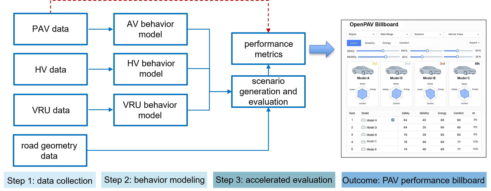
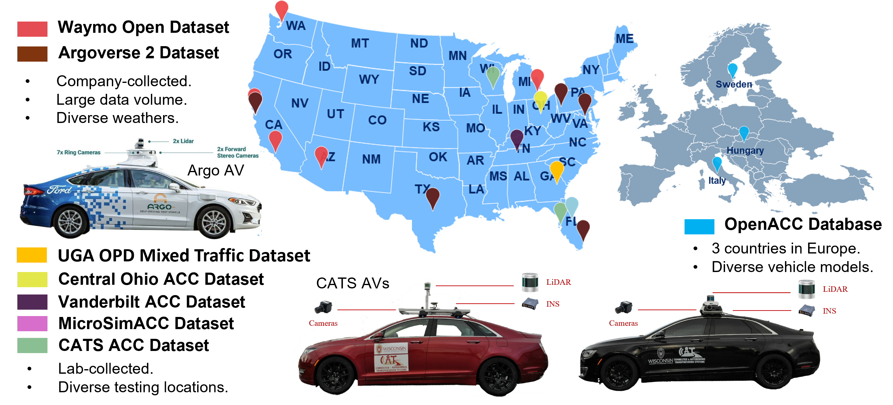

# Open-PAV

OpenPAV (Open Production Automated Vehicle) is an open platform designed to facilitate **data collection, behavior modeling, and performance evaluation** of production automated vehicle (PAV). It integrates diverse datasets and calibrated vehicle models, making it an essential tool for researchers and developers aiming to study PAV dynamics and their impacts. The project encourages contributions from the research community and provides ready-to-use model parameters for seamless integration with simulation tools. Check the [OpenPAV Website](https://openpav.github.io/OpenPAV) for more details.

## Data Sources and Contributors

### Original Data Sources:

Currently the dataset has examined 14 open-source datasets from 7 providers, each providing distinct insights into AV behavior across various driving conditions and scenarios. They are:

- **Argoverse 2 Motion Forecasting Dataset**. Collected from Austin in Texas, Detroit in Michigan, Miami in Florida, Pittsburgh in Pennsylvania, Palo Alto in California, and Washington, D.C. by Argo AI with researchers from Carnegie Mellon University and the Georgia Institute of Technology. Available at -  [Argoverse 2 Motion Forcasting Dataset](https://www.argoverse.org/av2.html).
- **CATS Open Datasets**. Three datasets were gathered in Tampa, Florida, and Madison, Wisconsin by the CATS Lab. Available at - [CATS Lab](https://github.com/CATS-Lab).
- **Central Ohio ACC Datasets**. Two datasets were collated in Ohio by UCLA Mobility Lab and Transportation Research Center. Available at - [Advanced Driver Assistance System (ADAS)-Equipped Single-Vehicle Data for Central Ohio](https://catalog.data.gov/dataset/advanced-driver-assistance-system-adas-equipped-single-vehicle-data-for-central-ohio).
- **MircoSimACC Dataset**. Collected in four cities in Florida, including Delray Beach, Loxahatchee, Boca Raton, and Parkland by the Florida Atlantic University research group. Available at  - [microSIM-ACC](https://github.com/microSIM-ACC).
- **OpenACC Database**. Four datasets were collected across Italy, Sweden, and Hungary by the European Commission's Joint Research Centre. Available at - [data.europa.eu](https://data.europa.eu/data/datasets/9702c950-c80f-4d2f-982f-44d06ea0009f?locale=en).
- **Vanderbilt ACC Dataset**. Collected in Nashville, Tennessee by Vanderbilt University research group. Available at - [Adaptive Cruise Control Dataset](https://acc-dataset.github.io/).
- **Waymo Open Dataset**. Two datasets were collected in six cities including San Francisco, Mountain View, and Los Angeles in California, Phoenix in Arizona, Detroit in Michigan, and Seattle in Washington by Waymo. Available at - [Waymo Motion Dataset](https://waymo.com/open/data/motion/) and [Vehicle trajectory data processed from the Waymo Open Dataset](https://data.mendeley.com/datasets/wfn2c3437n/2).

### Processed Data Source:

By organizing the data from the above datasets, we processed a unified trajectory dataset ULTra-AV, in which all data are represented using a standardized format. Available at -  [A unified longitudinal trajectory dataset for automated vehicle](https://www.nature.com/articles/s41597-024-03795-y) and [ULTra-AV](https://github.com/CATS-Lab/Filed-Experiment-Data-ULTra-AV).

## What's New

- **March 2026:** The project has launched a new interface.
- **November 2024:** Initial project startup with installation and user guides.

## Major Components

Open-PAV consists of the following components:

- **Data Process:** Given the raw AV data (LiDAR, images, videos, trajectories) as input, this module converts data of the same type into a unified format and performs preliminary data cleaning.
- **Behavior Modeling:** Using the processed AV data, this module calibrates the vehicle kinematic models of automated vehicles and exports them for simulation use. Users can also directly input their AV software stack to test their developed AV system within this module.
- **Accelerated Evaluation:** This module is designed to generate tailored safety-critical driving scenarios specific to a given AV model, aiming to evaluate its safety performance.

## Contributors

### Contributing Groups

- [CATS Lab](https://catslab.engr.wisc.edu/) (PI: [Xiaopeng Li](https://catslab.engr.wisc.edu/staff/xiaopengli/))

- [ACEMS Lab](https://github.com/ACEMS-lab) (PI: [Tom Shi](https://www.xiaoweitom.com/))

- [CAT Lab](http://www.connectedandautonomoustransport.com/dr-zhengs-research.html) (PI: [Zuduo Zheng](https://civil.uq.edu.au/profile/857/zuduo-zheng))

- [SHINE Lab](https://sites.google.com/site/danjuechen/) (PI: [Danjue Chen](https://ccee.ncsu.edu/people/danjuechen/))

- [NextGen-ITS Lab](https://www.linkedin.com/in/david-kan-89b871ab/) (PI: [David Kan](https://www.linkedin.com/in/david-kan-89b871ab/))

- [Mobility Lab](https://yaohandong.github.io/MobilityLab/index.html) (PI: [Handong Yao](https://engineering.uga.edu/team_member/handong-yao/))

- [KITE Lab](https://github.com/KITE-Lab/) (PI: [Ke Ma](https://www.linkedin.com/in/ke-ma-1b32b0229/))

- [CAMIs Lab](https://sites.google.com/view/camis-uga/people/q-li) (PI: [Qianwen Li](https://engineering.uga.edu/team_member/qianwen-li/))

- [Yanbing Wang's Lab](https://yanbingwang.com/index.html) (PI: [Yanbing Wang](https://yanbingwang.com/index.html))

- [iUTS Lab](http://depts.washington.edu/iuts/wordpress/) (PI: [Xuegang (Jeff) Ban](https://www.ce.washington.edu/facultyfinder/xuegang-jeff-ban))

### Industry Partner

- Gemma Wang (May Mobility)

### Technical Contributors

- [Hang Zhou](https://catslab.engr.wisc.edu/staff/zhou-hang/) (hzhou364@wisc.edu)
- [Ke Ma](https://markmaaaaa.github.io/KeMa.github.io/) (kma62@wisc.edu)
- Keke Long (klong23@wisc.edu)
- Chengyuan Ma (cma97@wisc.edu)
- [Ziyi Zhang](https://search.asu.edu/profile/5310363) (zzhan657@asu.edu)
- Xiangyu Li (xli312@connect.hkust-gz.edu.cn)
- [Mingyuan Yang](https://www.linkedin.com/in/mingyuan/) (mingyuan_yang@txstate.edu)
- [Tianle Zhu](https://www.linkedin.com/in/tianle-zhu-6aba87251/) (tl.z@uga.edu)
- Muhammad Fahad (muhamm72@uwm.edu)

### Related Publications:

- Zhou, H., Ma, K., Liang, S., Li, X., and Qu, X. (2024). *A unified longitudinal trajectory dataset for automated vehicle*. *Scientific Data*, 11, 1123.

### Acknowledgements:

This project is partially supported by the National Science Foundation (NSF) through "[NSF	CPS: Small: NSF-DST: Turning “Tragedy of the Commons (ToC)” into “Emergent Cooperative Behavior (ECB)” for Automated Vehicles at Intersections with Meta-Learning](https://www.nsf.gov/awardsearch/show-award?AWD_ID=2343167)" (No. 2343167). We also acknowledge the support from [IEEE Intelligent Transportation Systems Society (ITSS) Emerging Transportation Technology Testing (ET3) Technical Committee](https://ieee-itss.org/chapters-committees/emerging-transportation-technology-testing).

We also sincerely appreciate all the dataset providers and contributors for making this work possible. 

## License

Open-PAV is released under the [MIT License](LICENSE). See the LICENSE file for details.

